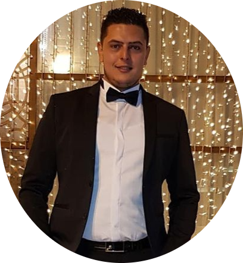

# Projet portfolio développeur
## CV Tabai Lahmar
### Pour le code html minimal

```
<!DOCTYPE html>
<html lang="en">
<head>
    <meta charset="UTF-8">
    <meta http-equiv="X-UA-Compatible" content="IE=edge">
    <meta name="viewport" content="width=device-width, initial-scale=1.0">
    <meta name="description" content="CV Lahmar Tabai">
    <link rel="apple-touch-icon" sizes="180x180" href="asset/apple-touch-icon.png">
    <link rel="icon" type="image/png" sizes="32x32" href="asset/favicon-32x32.png">
    <link rel="icon" type="image/png" sizes="16x16" href="asset/favicon-16x16.png">
    <link rel="manifest" href="asset/site.webmanifest">
    <link rel="stylesheet" href="https://cdnjs.cloudflare.com/ajax/libs/font-awesome/5.15.3/css/all.min.css" integrity="sha512-iBBXm8fW90+nuLcSKlbmrPcLa0OT92xO1BIsZ+ywDWZCvqsWgccV3gFoRBv0z+8dLJgyAHIhR35VZc2oM/gI1w==" crossorigin="anonymous" />
    <link rel="stylesheet" type="text/css" href="https://maxcdn.bootstrapcdn.com/font-awesome/4.7.0/css/font-awesome.min.css">
    <title>CV</title>
    <link rel="stylesheet" href="./css/style.css" media="screen" type="text/css">
</head>
<body>
    <header>
        <h1>LAHMAR TABAI</h1>
        <p>En recherche d'une Alternance en développement Web</p>
    </header>

    <main>

        <section>
            <h2>COMPÉTENCES</h2>
            <ul>
                <li>Solides compétences en organisation et encollaboration au sein d'une entreprise.</li><!-- whitespace
             --><li>Connaissances des langages de programmation : </li><!--
             --><li>Python, Java, C, C++, Js, SQL, Html<sup>5</sup> et Css<sub>3</sub></li><!--
             --><li>Utilisation de logiciels comme Eclypse, Visual CodeStudio, VMware, Packet-tracer.</li><!--
             --><li>Maitrise de logiciels bureautiques : Pack Office.</li>
            </ul>
        </section>

        <section>
            <h2>FORMATIONS</h2>
            <ul class="bord">
                <li>BTS SIO SLAM, Solution logicielles et ApplicationsMétiers</li><!-- whitespace
             --><li>Institut des techniques informatiques et commerciales Paris (Encours de préparation) Promotion 2020.</li><!--
             --><li>Diplôme Licence Appliquée en Anesthésie et Soins Intensifs</li><!--
             --><li>Ecole Centrale Supérieure Privée des sciences paramédicales et de laSanté de Tunis, Promotion 2015.</li><!--
             --><li>Diplôme Licence Appliquée en Sciences Infirmières</li><!--
             --><li>Institut Supérieur des sciences infirmières de Tunis (ISSIT),Promotion 2011.</li><!--
             --><li>Baccalauréat Sciences Expérimentales</li><!--
             --><li>Lycée secondaire de Nafta, juin 2008.</li>
            </ul>
        </section>

        <section>
            <h2>LANGUES</h2>
            <ul>

                <li><strong>Francais : </strong>Niveau avancé.</li><!-- whitespace
             --><li><strong>Anglais : </strong>Niveau avancé.</li><!--
             --><li><strong>Allemand : </strong>Niveau intermédiaire.</li><!--
             --><li><strong>Arabe : </strong>Niveau avancé.</li>
            </ul>
        </section>

        

    </main>

    <aside class="part2">

        <section>
            <h2 class="toto">Lahmar Tabai</h2>
            <figure class="card">
                
            </figure>
        </section>

        <section>
            <h2>CONTACT</h2>
            <ul>
                <li><a href="https://www.google.com/maps/place/11+Bd+de+l'Orangerie,+95160+Montmorency/@48.9830999,2.3176914,16.74z/data=!4m5!3m4!1s0x47e6685a1af72985:0x4e061bdbc1f12ed7!8m2!3d48.9832284!4d2.320281" title="My Adresse" target="blank"><i class="fas fa-map-marker-alt" aria-hidden="true"></i><strong> Adresse : </strong>11 Bloulevarde de l'orangerie Montmorency 95160</a></li><!-- whitespace
             --><li><a href="#" title="My Phone Number"><i id="phone" class="fa fa-phone" aria-hidden="true"></i> 07 50 02 74 45</a></li><!--
             --><li><a href="mailto:lahmartabai@yahoo.fr"><i id="tab" class="fa fa-user" aria-hidden="true"></i> lahmartabai@yahoo.fr</a></li><!--
             --><li><a class="frog" href="https://www.linkedin.com/in/tabai-lahmar-74b33a210/" title="My Linkedin" target="blank"><i id="linkedin" class="fab fa-linkedin"></i><strong> Linkedin : </strong>https://www.linkedin.com/in/tabai-lahmar-74b33a210/</a></li>
            </ul>
        </section>

        <section>
            <h2 class="roger">EXPÉRIENCES PROFESSIONNELLES</h2>
            <ul class="dog">
                <li>Technicien d'Anesthésie et Soins Intensif :</li><!-- whitespace
             --><li>Polyclinique Les Berges Du Lac (Tunisie). | 2016 - 2020</li><!--
             --><li>Infirmier en salle de cathétérisme cardiaque :</li><!--
             --><li>Polyclinique cardiologique Elamen (Tunisie). | 2012 - 2013</li>
            </ul>
        </section>

        <section>
            <h2>CENTRES D'INTÉRÉTS</h2>
            <ul>
                <li>Apprendre et bien maitriser de nouveaux langages en programmation.</li><!-- whitespace
             --><li>Concevoir des programmes destinés à la gestion d'une Organisation. </li>
            </ul>
        </section>

        <section>
            <h2>ATOUT PERSONNEL</h2>
            <ul>
                <li>* Persévérant.</li><!-- whitespace
             --><li>* Actif.</li><!--
             --><li>* Créatif.</li><!--
             --><li>* Coopératif.</li>
            </ul>
        </section>
    </aside>

    
    
    <script src="./js/app.js"></script>
</body>
</html>

```


### Pour le css

```

/* reset CSS */
@import url('https://fonts.googleapis.com/css2?family=Libre+Baskerville&display=swap');

@import url('https://fonts.googleapis.com/css2?family=Open+Sans:wght@300;400;600&display=swap');
html{
    font-size: 62.5%;
    
}
body{
    font: 1.6rem 'Open Sans', sans-serif; 
    margin: 0;
}

p, a, figure, h1, h2, h3, h4, ul, li,section, ol, section{
    margin: 0;
    padding: 0;
    list-style: none;
    text-decoration: none;
    color: initial;
}

*{
    box-sizing: border-box;
}

/* thème */

:root{
    --color-defalt: #373741;
    --color-main: #ffffff;
    --color-text-header: #e1d8cf;
    --color-text-var: #FE2712;
}

header {
    line-height: 4rem;
    background-color: var(--color-defalt);
    margin-bottom: 5rem;
    padding-top: 4rem;
    font-family: 'Libre Baskerville', serif;
}

header h1 {
    padding-bottom: 1rem;
}

header h1, header p {
    color: var(--color-text-header);
    text-align: center;
}


body{
    max-width: 90rem;
    margin: 0 auto 2rem;
    padding-top: 6rem;
    background-color:rgba(247, 241, 241, 0.863);

}

section h2 {
    line-height: 6rem;
    text-transform: capitalize;
}

section p {
    line-height: 2.5rem;
    font-weight: normal;
    text-align: justify;
   
}

section li {
    line-height: 2.5rem;
    font-weight: normal;
    padding-left: 1rem;
}

section li:first-child {
    padding-top: .8rem;
}

body {
    position: relative;
    background-color: var(--color-main);
    
}


main {
    position: absolute;
    background-color: var(--color-main);
    top: 0%;
    left: 50%;
    right: 0;
    z-index: 1;
    padding-top: 25rem;
    height: 132rem;
}

header {
    position: absolute;
    top: 50%;
    left: 50%;
    right: 0;
    z-index: 2;
    height: 20rem;
}

.part2 {
    position: absolute;
    top: 0;
    left: 0;
    right: 50%;
    background-color: var(--color-text-header);
    height: 132rem;
}

.card img{
    display: block;
    width: 100%;
    padding: 6rem;
}

section h2 {
    background-color: var(--color-defalt);
    color: var(--color-text-header);
    margin: .5rem 1.5rem;
    padding-left: 1rem;
    font-family: 'Libre Baskerville', serif;
}

html {
    background-color: #0e1318;
}

footer {
    position: absolute;
    bottom: 0;
    left: 50%;
}

section ul li{
    line-height: 2.5rem;
    padding-left: 2.5rem;
}

main section ul li {
    padding-bottom: 1.16rem;
    padding-right: 1.5rem; 
}

.bord li:nth-child(2n + 1) {
    font-weight: bold;
    font-family: Georgia, 'Times New Roman', Times, serif;
}

.roger {
    font-size: 1.9rem;
}

.dog li:nth-child(2n + 1) {
    font-weight: bold;
    font-family: Georgia, 'Times New Roman', Times, serif;
    padding-top: 1rem;
    padding-bottom: .5rem;
}

#phone{
    color: #069c06;
}

#linkedin {
    color: #067ff8;
}

.toto {
    display: none;
}

section ul a:hover, #tab:hover{
    color: #3683da;
    text-decoration: underline;
}

```

#[Tux, the Linux mascot](./asset/img.png)